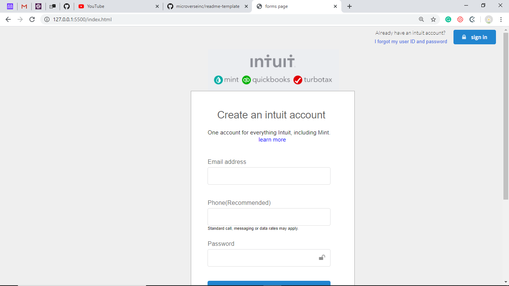

Mint-sign-up-page 

This is a clone of mint.com's sign up page.

Additional description about the project and its features.

# Built With

-HTML & CSS
-Semantic css frameworks.

# Prerequisites
Visual Studio code editor

# Authors

👤 **Rose**

- Github: (https://github.com/blackpintz)
- Twitter:(https://twitter.com/blackpintz)

👤 **Precious**

- Github: (https://github.com/evabanegacom)
- Linkedin:(https://www.linkedin.com/in/precious-udegbue-a3468314a/)

# 🤝 Contributing
Contributions, issues and feature requests are welcome!

Feel free to check the issues page.

Show your support
Give a ⭐️ if you like this project!

# Acknowledgments

mint sign up page.

etc
📝 License
This project is MIT licensed.
